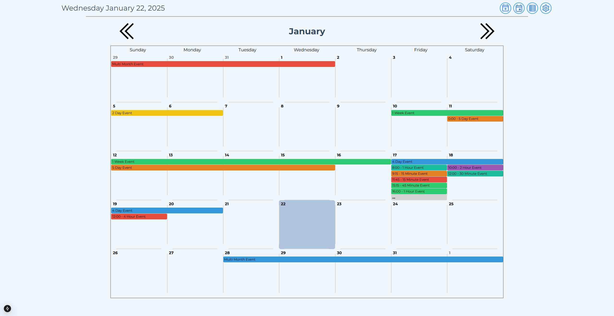

# Calendar Webpage

A calendar webpage for scheduling events.

Tech Stack: Next.js, React 19, TailwindCSS, Material-tailwind

Node version: 22.13.0

## Features
  - A responsive webpage that displays a monthly/weekly/daily view calendar
  - Create/Edit events that appear in time order and span the relevant days
  - Events are color coordinated to make them easier to differentiate

## WIP
  - Weekly/Daily views are still being configured to show events
  - Settings button and what will appear in it are still being considered

## Demo photo

More demo photos can be viewed in the demo folder.

## Development decisions

### State management

- https://react.dev/learn/scaling-up-with-reducer-and-context
- Initially, I was using Redux to control global state, but after upgrading to React 19 I opted to switch to useContext
since the complexity of my app was not high

### Currently running React 19 with @types/react 18
  - https://github.com/creativetimofficial/material-tailwind/issues/528
  - Material-tailwind has type issues with @types/react v19
  - Will have to run `npm install --legacy-peer-deps` in the meantime